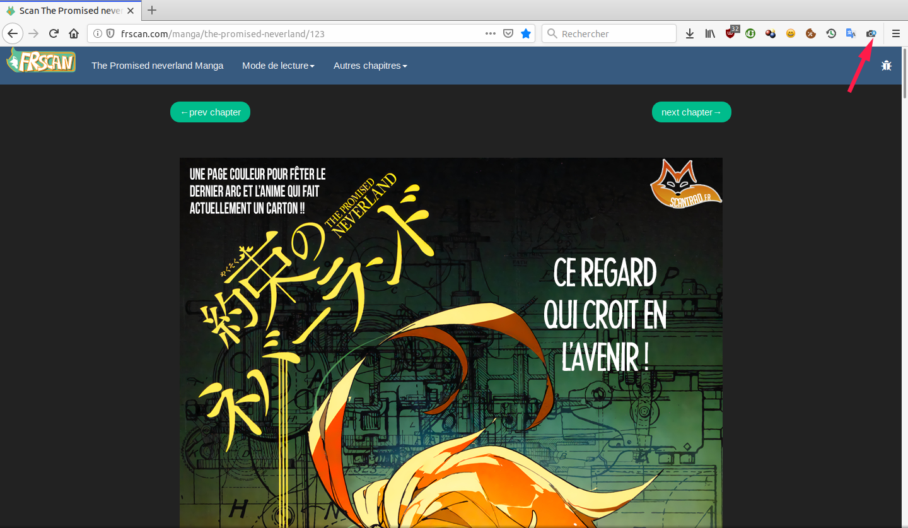
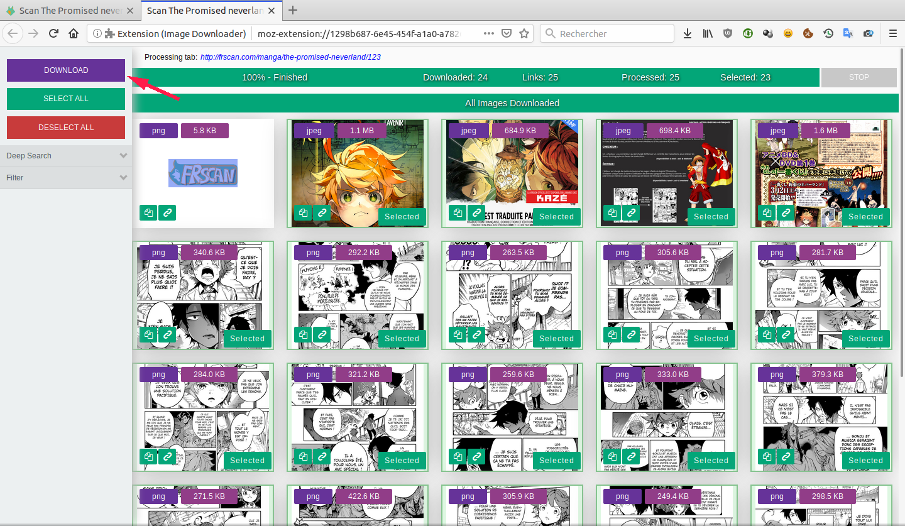

#  Easy Image Downloader

> **Easy to use and powerful image downloader for your browser.**

Easily save all images in a website to a zip file with just one simple click.

Open extension tab  | Download in one click
------------------- | ---------------------
 | 

## Features

- Choose images you want
- Adjust search depth (useful on sites like google images)
- Filter by size, type or dimension
- Download in one click

## Installation

## Credits

Original work was done by [Karl](https://addons.mozilla.org/user/13834224/).

## License

Easy Image Downloader is licensed under the [MPL2 license](LICENSE).
