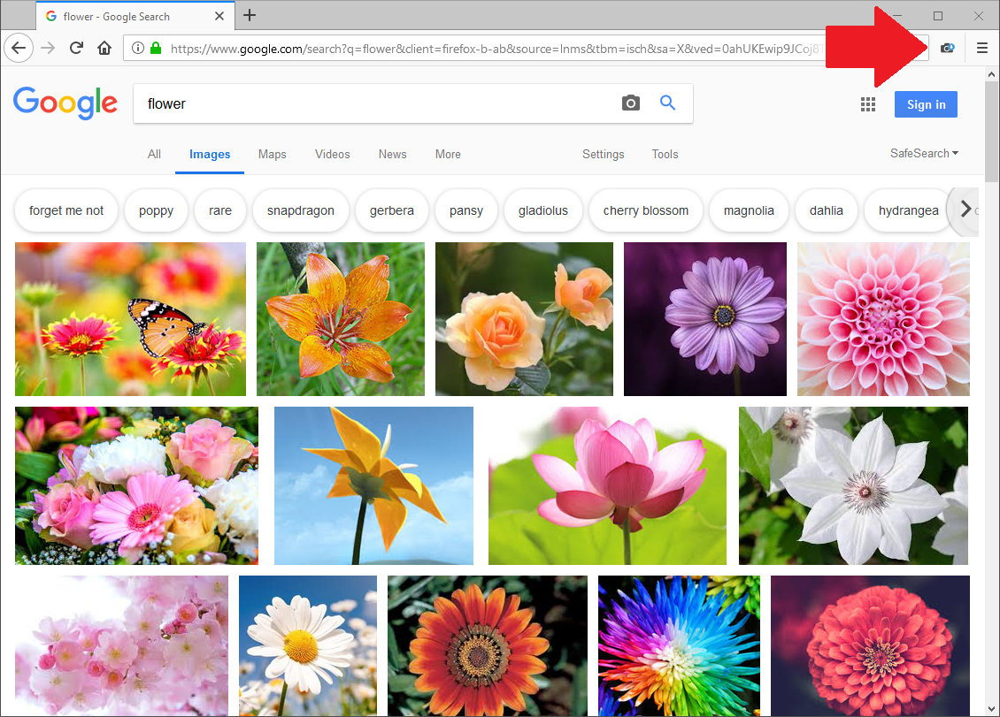
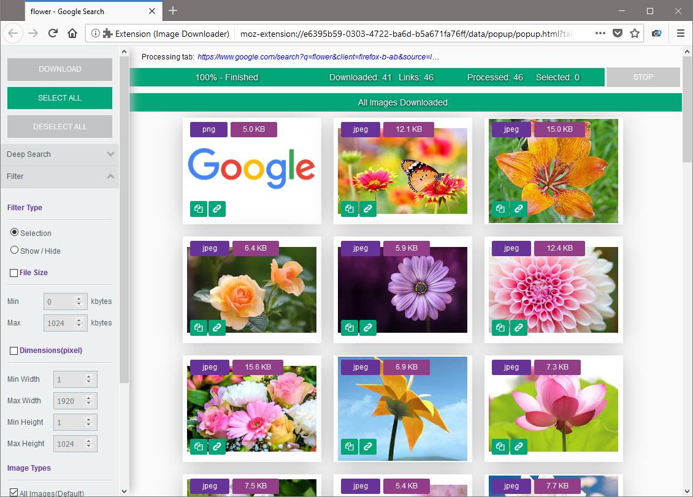

Easy Image Downloader
=====================

**Easy to use and powerful image downloader for your browser.**

Easily save all images in a website to a zip file with just one click!

## Features

- Simple & easy to use
- Allows mono & multi selection
- Search for images by keywords
- Filter by size, type or dimension
- Download in one click

## Installation

You can install the extension from [Firefox Add-ons](#).

## Credits

Original work was done by [Karl](https://addons.mozilla.org/fr/firefox/user/13834224/).

## License

Easy Image Downloader is licensed under the [MPL2 license](LICENSE).
